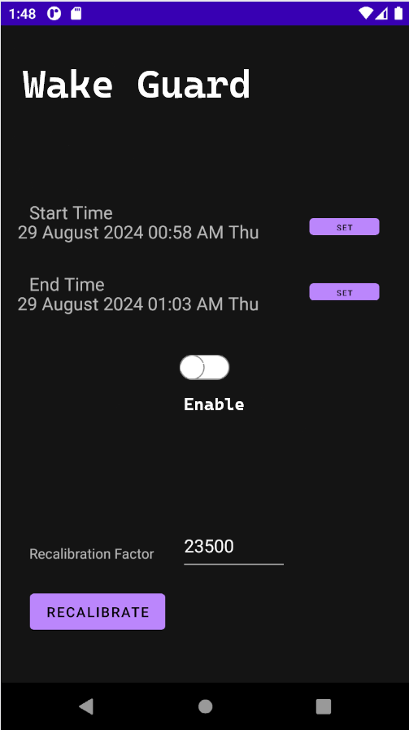
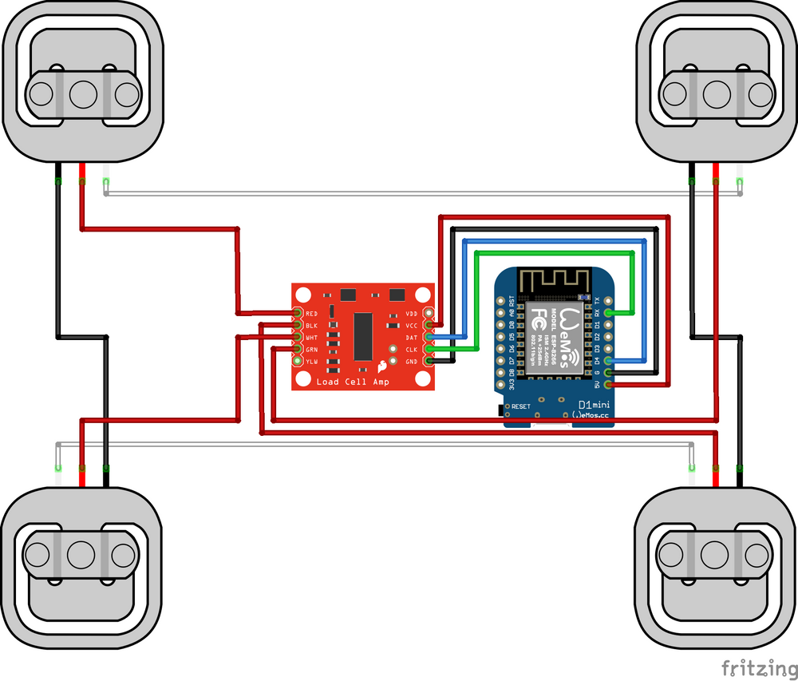
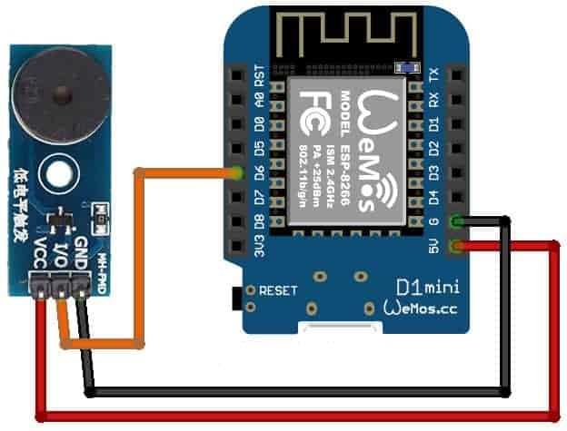

# WakeGuard - Intelligent IoT-Based Alarm App

## Project Motivation

Waking up early in the morning is a challenge faced by many individuals, often leading to repeated reliance on alarm clocks that fail to achieve the desired result. Many people find themselves in a continuous struggle to wake up on time, only to turn off their alarms and fall back asleep, thereby missing out on a productive start to the day. This is a widespread problem, especially in today’s fast-paced world, where maintaining a consistent morning routine is crucial for success.

The solution needed to be more than just a traditional alarm clock that rings at a set time. It required a smarter approach that could monitor whether someone is still in bed and ensure they stay awake. The idea was to develop a device that not only detects when a person is still sleeping but also triggers an alarm that continues until they have fully left the bed. Furthermore, to prevent the user from returning to sleep after waking up, the system needed to re-trigger the alarm if it detected a return to bed within a specified monitoring period.

This led to the creation of an IoT device, paired with a mobile application, capable of monitoring bed pressure and ensuring that the user remains awake. This project addresses a common challenge faced by many and showcases the practical application of IoT technology and mobile app development in solving real-world problems.

## WakeGuard App Description

**WakeGuard** is an innovative Android application designed to help users overcome the common struggle of waking up on time and staying awake. The app works in conjunction with two IoT modules: a **Bed Sensor** and a **Monitoring System**. These components are strategically placed in the user's bedroom to ensure they get out of bed and stay out.

### Components

- **Bed Sensor**: This sensor attaches to the legs of the bed and is responsible for detecting the weight on the bed. It starts monitoring three hours before the set alarm time and continues until the alarm duration ends.

- **Monitoring System**: This module can be discreetly installed on a high ceiling or behind a piece of furniture, making it difficult to access and disable. When the bed sensor detects that the user is still in bed at the start of the alarm, it signals the monitoring system to trigger a persistent alarm.

### Key Features

- **Customizable Alarm Duration**: Users can set a start time and an end time for the alarm. The system ensures that the user does not fall back asleep during this period.
- **Proactive Monitoring**: Three hours before the alarm, the bed sensor begins recording the weight on the bed, preparing the system to detect when the user remains in bed.
- **Intelligent Alarm System**: If the bed sensor detects weight on the bed at the alarm start time, the monitoring system triggers the alarm. The alarm will continue until the bed is vacated.
- **Reactivation Feature**: Even after getting out of bed, if the user lies down again during the alarm duration, the bed sensor reactivates the monitoring system, causing the alarm to ring again until the user gets out of bed.

### Availability

The WakeGuard app is currently available exclusively for Android devices.

## Parts Used

The WakeGuard project utilizes the following components to create a reliable and effective IoT-based alarm system:

- **Wemos D1 Mini - IoT ESP8266 Based Development Board (x2)**: These compact and powerful microcontroller boards form the core of the WakeGuard system, handling the communication between the bed sensor and the monitoring system.
- **50kg Half-bridge Experiments Body Scale Load Cell Sensor**: This sensor is used to measure the weight on the bed, allowing the system to detect whether the user is still lying down.
- **Active Buzzer Module**: This component is responsible for generating the alarm sound when triggered by the monitoring system.
- **HX711 Amplifier**: This amplifier is used in conjunction with the load cell sensor to accurately measure and transmit weight data to the Wemos D1 Mini.

## The App

The app is designed with a user-friendly interface that is both intuitive and simple to use. It features a single interface where users can easily set the start and end times for the alarm. If the specified alarm times are in the past or if the start time is later than the end time, the app will display an error message. Once the correct times are set, users can simply press the "Enable" button, and the app will automatically activate the alarm. The alarm will then function autonomously, triggering at the designated times each day without further input.

Additionally, the app includes a recalibration feature to ensure the accuracy of the sensor readings over time. As sensors can drift, causing the default zero measurement to become inaccurate, the app automatically recalibrates the sensor when no one is present on the bed to maintain an accurate zero value. Users also have the option to manually recalibrate the sensor through the app, ensuring consistent performance.

## The Bed Sensor

The Bed Sensor is composed of the Wemos D1 Wi-Fi module and an HX711 amplifier, which works in conjunction with weight sensors to accurately measure the weight on the bed. This data is then transmitted to both the app and the monitoring system.

The communication between the Bed Sensor, the app, and the monitor is facilitated by the MQTT protocol (Message Queuing Telemetry Transport). MQTT is a lightweight messaging protocol that operates on a publish-subscribe model, making it highly efficient for IoT applications where bandwidth and power consumption are critical.

In this setup, the Bed Sensor publishes the measured weight data to a specific MQTT topic or channel. Both the app and the monitor are subscribed to this channel, meaning they will receive real-time updates whenever the Bed Sensor publishes new data. This approach ensures that the alarm system is always responsive and up-to-date with the user's status on the bed.

## The Monitor

The Monitoring System is equipped with an active buzzer and a Wemos D1 Wi-Fi module. It operates by subscribing to two MQTT channels: the weight channel and the alarm enable channel.

When the alarm is enabled and the weight on the bed exceeds a predefined threshold, the Monitoring System activates the alarm. The alarm will continue to sound until the weight detected by the Bed Sensor drops below the threshold, indicating that the user has left the bed. This ensures that the alarm persists until the desired outcome—getting out of bed—is achieved.

## MQTT Protocol

MQTT Protocol
MQTT (Message Queuing Telemetry Transport) is a lightweight messaging protocol that is widely used in IoT (Internet of Things) applications. It is designed to provide reliable communication with minimal network bandwidth and power consumption, making it ideal for environments where resources are constrained.

MQTT operates on a publish-subscribe model, where devices (clients) can publish messages to topics, and other devices can subscribe to these topics to receive messages. This decouples the message producers (publishers) from the message consumers (subscribers), allowing for flexible and scalable communication.

How MQTT Works in WakeGuard
In the WakeGuard system, MQTT is used to facilitate communication between the Bed Sensor, the Monitoring System, and the mobile app. The Bed Sensor publishes weight data to a specific MQTT topic (referred to as the weight channel), and the Monitoring System and the app are subscribed to this topic. Similarly, there is an alarm enable channel that the Monitoring System subscribes to in order to determine whether the alarm should be activated.

Using HiveMQ as the MQTT Broker
For this project, HiveMQ is used as the MQTT broker. The broker acts as an intermediary, managing the routing of messages between clients (in this case, the Bed Sensor, Monitoring System, and the app). HiveMQ is a robust and scalable MQTT broker that is well-suited for IoT applications, providing reliable message delivery and efficient handling of multiple connected devices.

By utilizing HiveMQ, the WakeGuard system ensures that data is transmitted securely and reliably between the various components, enabling the alarm system to function effectively and consistently. HiveMQ’s cloud-based architecture also allows for easy scalability, making it possible to extend the system or integrate additional devices in the future.

## Future Enhancements

While the app currently supports only a single alarm duration, future updates will introduce the ability to set and manage multiple alarms, providing users with greater flexibility and control over their wake-up routines.

Additionally, the app will feature an integrated exercise module. To deactivate the alarm on the first attempt, users will be required to perform a series of sit-ups or another specified exercise. This will ensure that users are fully awake before the alarm enters its normal monitoring mode, which will continue to check that the user does not return to bed.

We also plan to implement a user weight registration feature. This enhancement will allow the system to recognize individual users based on their weight, ensuring that the alarm only activates when the registered user is in bed. This means that if another person is on the bed—whether sleeping or sitting—the alarm will remain inactive, adding a personalized aspect to the monitoring system.

Finally, future versions of the app will offer a wider range of themes and color schemes, allowing users to customize the app's appearance to their preferences.

## Credits

The design of the Bed Sensor system in the WakeGuard project is inspired by the bed occupancy sensor detailed on the [Everything Smart Home website](https://everythingsmarthome.co.uk/building-a-bed-occupancy-sensor-for-home-assistant/). Their innovative approach provided valuable insights that helped shape the development of our own bed occupancy monitoring system.